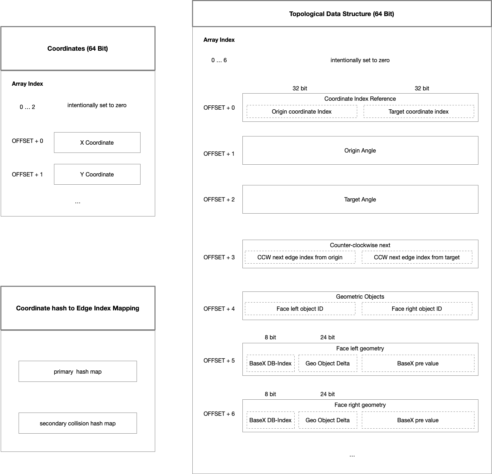

TopoX Architecture
===================

**etf-topox**

This document is a working draft.

Introduction and Goals 
======================

TopoX is an extension module for the XML BaseX database and is used in the ETF for the testing of spatial data for topological issues. TopoX supports the parsing, validation and retrieval of topological information from spatial data in a BaseX database.

TopoX was developed for the AdV-testsuite and was driven by two main goals:

- fast processing of complex spatial data
- support for validating huge data sets (hundreds of Gigabyte)

Requirements Overview
---------------------

The module must parse certain, selectable geometries from a BaseX database, validate the topology, and provide simple interfaces for post validating the topological data for specific aspects like holes in surfaces.

The module must support the parsing of _GML Line String Segments_ as well as _GML Arcs_ geometries.

It must be possible to detect holes and free-standing surfaces.

Boundaries (e.g. from Features that represent borders) must be validatable, i.e. by following a sequence of edges of the topological graph.

Quality Goals
-------------

The most important quality goal is to ensure the **performance effiecency** :

- high performance parsing, validating and retrieval of topological data
- with a very low memory foodprint

Almost as important is the **relieabilty** of the module, especially the fault tolerance: invalid input data must be reported, but must not invalidate the entire topological data structure (local invalidation of edge data is _fine_ and can not be avoided).

A **trade-off** must be made in terms of maintainability in favor of performance efficiency. Accordingly, the documentation of the topological data structure (also in case of changes) is important in order to minimize this issue.

System Scope and Context
========================

Todo

Show:

- BaseX
- TopoX
- ETF

Technical Context
-----------------
Todo 

Show:

- BaseX database
- TopoX
- TopoX Parser
- TopoX topological data structure 
- TopoX error file
- ETF ETS

Solution Strategy
=================

In the first tests an attempt was made to build the data structure directly in BaseX. This approach proved too slow due to the sync and write locking mechanism of BaseX. In addition, the memory consumption for the topological data structure was quite high even with small databases.

Java-based prototypes that kept the data structure completely in memory showed much better results (which is not very surprising). By using only primitive types and simple compression techniques, memory consumption has been further minimized. Thus, the runtime for the parsing and validation of 100 GB of spatial data could be reduced from 50 minutes to 6 minutes.

Building Block View
===================

Todo 

Show:

- TopoX XQuery Facade
- TopoX Java Facade
- Theme
- TopologyBuilder
- Topology interface
- BoundaryBuilder

Cross-cutting Concepts
======================

Data Structure
---------------

The Topological Data Structure is based on the concept of a [doubly-connected edge list](http://www.cs.sfu.ca/~binay/813.2011/DCEL.pdf). The TopoX data structure is extended with additional information in order to allow retrieving precalculated information, like:

- the origin/target angle
- the direction of the connected edge from origin/target ccw-next
- the object ID and the ID of the geometry
- if the objected defines interior/exterior boundaries

The topological data structure (TDS) is manifested in one one-dimensional long array. Each date is stored with an index. If the date needs less than a long (64 bit), it is saved together with another small date under one common index. The TDS can hold a maximum of 1.3176246e+18 edges.

The coordinates are stored in a separate double array. This saves one index in the TDS. Coordinate tuples are unique. 

X and Y coordinates are mapped to exactly one edge with a hashing mechanism.

### Coordinates

Todo

**Coordinate Index** : 

**X coordinates**:

**Y coordinates**:

### Topological Data Structure

This section describes the internal data structure. An interface for querying the topological information is describe here TODO.

**Edge Index** : addresses the topological information in the array. The Edge Index is not intended to directly reference data but should be used with an offset. Invariance: an Edge Index is greater equal 7 and divisible by 7.

**COORDINATE\_OFFSET** : the Edge Index + the COORDINATE_OFFSET references the origin and target coordinate indices. The first 32 bit represent the coordinate index of the origin point; the last 32 bit represent the coordinate index of the edge's target point in the Coordinates array.

**SOURCE\_ANGLE\_OFFSET** and **TARGET\_ANGLE\_OFFSET** : the offsets are used access the angle of the edge's origin point and the angle of the target point as radians. The double values are saved as long bits. The angles are mainly used to detect intersections when more than two edges are connected at one point.

**CCWI\_OFFSET** :
TODO

**OBJ\_OFFSET** :
TODO

**LEFT\_LOCATION\_INDEX** and **RIGHT\_LOCATION\_INDEX** :
aka Face left geometry and face right geometry
TODO

The maximum edges the data strcuture can hold is (9223372036854775807-7)/7 = 1.3176246e+18 .

### Coordinate hash to Edge Index Mapping

For each unique point, a mapping to exactly one edge is created.

For a lookup the merged X and Y coordinates are used to get the edge index.

To bypass the Java Autoboxing, a [Trove HashMap](http://webcache.googleusercontent.com/search?q=cache:JzEVc3h64v8J:trove4j.sourceforge.net/javadocs/gnu/trove/map/hash/TLongIntHashMap.html+&cd=3&hl=de&ct=clnk&gl=de) is used.
### Example

TODO

### BaseX node reference 

TODO

The reference is composed of three values:

**BaseX DB-Index**:
For the referencing of databases 8 bits are used, which allows up to 254 databases.

**Geo Object Delta**: Since the geometry BaseX pre value is stored structurally below the object, this value is greater then the BaseX pre geometric object value. By subtracting the object pre value from the geometric object pre value, it can be assumed that the number is less than 24 bits (16.777.216).

**BaseX pre geometric object value**:
TODO

### Finding holes and free-standing surfaces

To find holes and free-standing surface, as first step the fully built up data structure is traversed for all edges that do not possess an object on the right side.

#### Holes

If the edge borders an interior object on the left side (obj ID negative), then this is a hole.

If a hole is detected at an edge, all other connected edges in the hole are visted and marked, so that they are not found in the global search again and only one edge is reported.

#### Free-standing surfaces

If it borders an exterior object (left obj ID is positive), it may be a candidate for a free-standing area.

This can only be detected by iterating along the edges until we either return to this edge or find an edge that borders an object on the right side (which clearly indicates an topological error). If there is no object on the right side of an edge, a value will be set (Integer.MIN_VALUE) to indicate that the edge has been visited. Otherwise the edge will be found again in the global search for empty edges.

After each complete edge iteration, the first edge can be saved as a candiate for a free-standing surface. However, there are some candidates that should not be reported. These are exterior holes that "emerge" in the data structure when edges are intersecting. All candidates with less than three edges at an exterior hole will not be reported.

Of course, if only one candidate is found at the end, then there is no free-standing surface, but a clearly defined boundary defined by one or more objects.

If at least two candidates are found, then there are free-standing surfaces. In this case, the first edge of the freestanding surface, which possesses the fewest edges, is returned. 

Testing
---------------

### Data driven tests

The tests are performed with JUnit 5. For data-driven tests, the [JUnit Test Factory](https://junit.org/junit5/docs/5.0.1/api/org/junit/jupiter/api/TestFactory.html) and [XMLUnit](https://github.com/xmlunit/xmlunit) are used. The test concept can be outlined as follows:

Multiple test data files can also be compressed and stored in the *Test data* directory. The file extension must be `.zip`.

### Test data

TODO

Design Decisions
================

Geoemetry Parser
----------------------------

TODO

- avoid using external libraries like 

Risks and Technical Debts
=========================

TODO